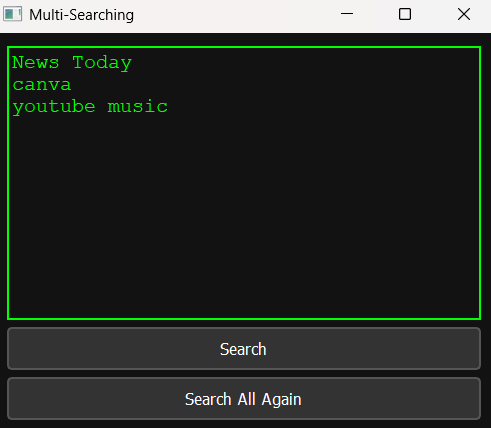

# Document Manager - Multi-Query Search Application

A simple and minimalistic search manager that allows users to input and manage multiple search queries, execute them in their default web browser, and track executed queries to avoid duplicates. The application has a **dark theme** with a **Matrix-like green text** effect for the text editor.

## Features
- **Multiple Query Support**: Add multiple queries, one per line, and run them all at once.
- **Run All Queries Again**: Re-run all previously executed queries if needed.
- **Executed Queries Tracking**: Keep track of which queries have been executed using a file (`executed_lines.txt`).
- **Dark Mode Theme**: A sleek dark mode interface with **green Matrix-style text**.
- **Cross-Browser Compatibility**: Opens the search queries in the default web browser (Chrome, Firefox, Edge, etc.).
- **Minimalistic Design**: A clean and intuitive user interface.

## Screenshots


## Installation

### Requirements
- **Python 3.x** or later
- **PyQt5** for the GUI
- A web browser (e.g., Chrome, Firefox, Edge) set as the default browser

### Steps
1. Clone this repository:
    ```bash
    git clone https://github.com/your-username/document-manager.git
    ```

2. Navigate to the project directory:
    ```bash
    cd document-manager
    ```

3. Install the required dependencies:
    ```bash
    pip install PyQt5
    ```

4. Run the application:
    ```bash
    python frontend.py
    ```

### Dependencies
- `PyQt5` - For building the GUI.
- `webbrowser` - To open search queries in the user's default browser.

## Usage

1. **Adding Queries**:
    - Open the application and type your search queries, one per line, in the text editor.
    - For example:
      ```
      Football shoes
      Football grounds near me
      Bus stops near me
      ```

2. **Executing Queries**:
    - Click the **Search** button to run the search for the queries that haven't been executed before.
    - Click **Search All Again** to run all queries again, even if they were executed before.

3. **Re-running Queries**:
    - If you accidentally close your browser windows, you can click the **Search All Again** button to re-execute all the queries previously entered in the editor.

4. **Tracking Executed Queries**:
    - The application tracks executed queries in the `executed_lines.txt` file to avoid running the same queries repeatedly.

## Features in Detail

### **Run Script**:
- This button will execute only the new queries that have not been previously executed. Once the queries are executed, they will be marked as completed in the `executed_lines.txt` file.

### **Search All Again**:
- This button will execute all the queries currently in the text editor, regardless of whether they have been executed before.

### **Text Editor**:
- The editor is styled with a **Matrix-like green font** to enhance the look and feel of the application. You can add any search term and run them in your default browser.

### **Dark Mode**:
- The entire interface has a sleek **dark theme**, which is easier on the eyes and visually appealing.

## Configuration
The application reads and writes the following files:
- **`doc.txt`**: Stores the search queries added by the user.
- **`executed_lines.txt`**: Tracks the queries that have been executed to avoid re-running them.

## Troubleshooting

### **Web Browser Not Opening**:
- If the application does not open your browser or runs an error, ensure that you have a default browser set on your system.

### **Text Editor Font Too Small**:
- If the font size in the text editor is too small, you can increase the font size by modifying the `font-size` property in the style settings of the `QTextEdit` widget.

## Contributing

Contributions are welcome! If you'd like to improve or extend the functionality of this application, feel free to fork the repository and submit a pull request.

### How to Contribute:
1. Fork this repository.
2. Create a new branch (`git checkout -b feature-branch`).
3. Commit your changes (`git commit -am 'Add new feature'`).
4. Push to the branch (`git push origin feature-branch`).
5. Open a pull request.

## License

This project is licensed under the MIT License - see the [LICENSE](LICENSE) file for details.

## Acknowledgements
- Thanks to the developers of **PyQt5** for providing the library to build beautiful desktop applications.
- The **Matrix green theme** was inspired by the iconic green text from the Matrix movie.

---

Feel free to customize and adapt this `README.md` as per your needs. It's structured to provide all necessary information about the project, installation, and usage.
